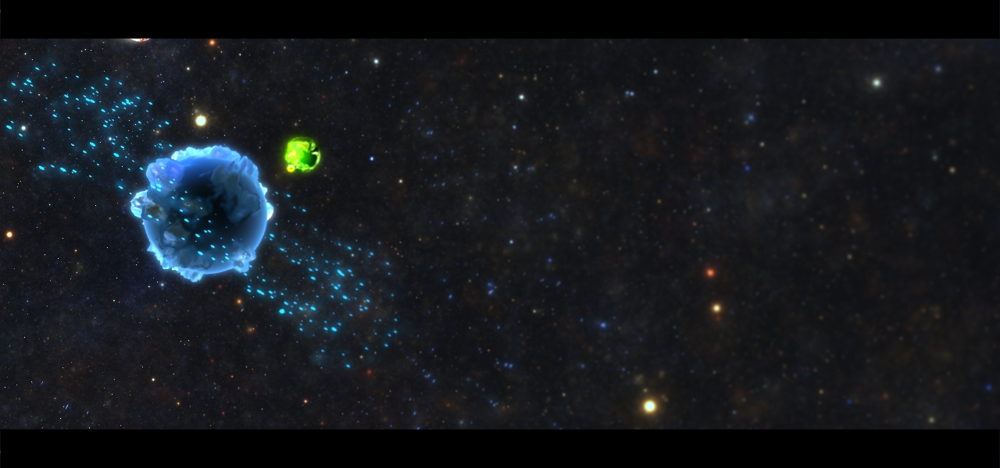

A universe rendering in Touchdesigner
=======================================
This is a universe simulation in TouchDesigner. It uses a glsl shader to simulate a universe with a large number of particles.

There are also some shaders for rendering the planets in a 3D space.

