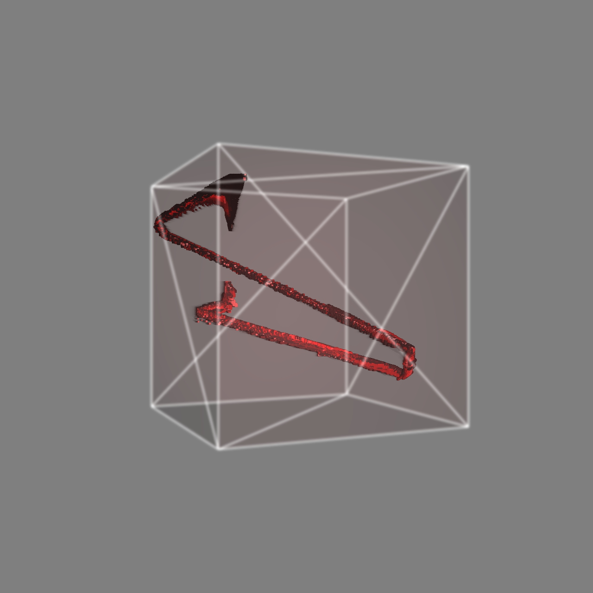

The structure of the Mindset
============================

This is an interesting project using the TD's build-in Component --- pointillize ----

The animation itself made me think of human beings, and the way they think.

Our mind is like a stabilizator that can bind to a steady state.

