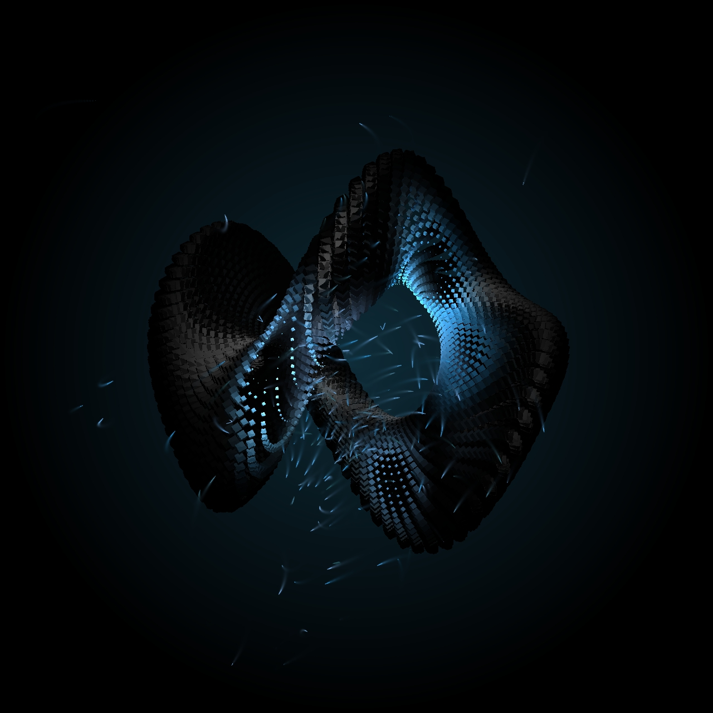

The Particle Statue
===================

This is a project for testing what I learn from [exsstas](https://www.youtube.com/@exsstas)'s youtube channel.

He taught a lot of things about using glsl in touchdesigner.

I used the [Interacive particles and SDF](https://www.youtube.com/watch?v=AhD33udrjYM&t=347s) technique to create this one.

