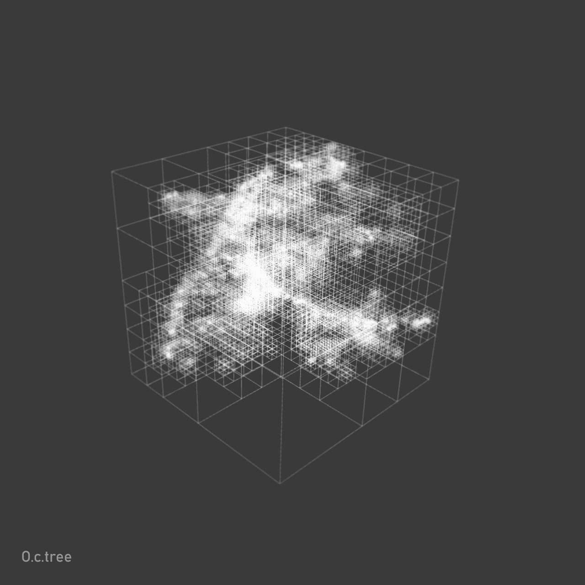

Quadtree: using python script to generate quadtree in TouchDesigner
===================================================================

This project is to experient the quadtree algrithm in TouchDesigner.

I wanna to achieve it in a compute shader but I don't know how to do.

So I use python script to generate the static quadtree in TouchDesigner.

Maybe in the future I will try to use compute shader, and make the real-time generation.

